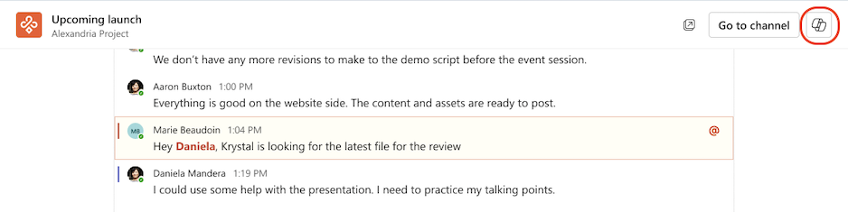

# Résumer les fils de conversation et de canal à l’aide de Microsoft 365 Copilot dans Teams
---
La maîtrise de Copilot pour Teams est une compétence essentielle pour les cadres qui cherchent à faciliter la collaboration et à obtenir des résultats concrets au sein de leurs équipes. Dans un monde où la communication se fait à un rythme très rapide, passer au crible les conversations et les fils de discussion sur les différents canaux pour en inférer des actions clés est une tâche qui demande beaucoup de temps. Copilot pour Teams révolutionne ce processus en analysant avec intelligence les conversations et en générant une liste concise des actions.

Les cadres et dirigeants qui exploitent cette capacité gagnent non seulement un temps précieux, mais ils peuvent aussi identifier et traiter rapidement des tâches critiques. Cette compétence améliore non seulement la productivité au sein de l’équipe, mais elle renforce aussi un leadership efficace, vous permettant d’anticiper les priorités et de favoriser une culture de l’efficacité. En tant qu’assistant collaboratif, Copilot pour Teams devient un atout inestimable afin d’amener les équipes à obtenir des résultats tangibles.

### Exercice

Lorsque vous utilisez Microsoft 365 Copilot pour Teams pour examiner les détails d’une conversation ou d’un canal spécifique, il peut fournir une liste de prompts prédéfinis et couramment utilisés, parmi lesquels vous pouvez alors choisir. Choisir un prompt dans cette liste vous évite de devoir l’entrer manuellement. Il fournit aussi des suggestions sur d’autres prompts que vous pouvez utiliser quand vous travaillez dans une conversation ou un canal.

Dans le volet **Copilot**, quand vous sélectionnez l’option **Plus de prompts**, Copilot affiche un menu déroulant contenant les prompts prédéfinis. Deux types de prompts prédéfinis sont disponibles :

 -  Des prompts liés au temps, tels que :
     -  Faits marquants de la dernière journée
     -  Faits marquants des 7 derniers jours
     -  Faits marquants des 30 derniers jours

 -  Des prompts non liés au temps, tels que :
     -  Quelles décisions ont été prises ?
     -  Quels sont les points en suspens ?
     -  Faits marquants de cette conversation (Canal de Teams)
     -  Récapituler la réunion (Conversation de Teams)

> **IMPORTANT :** Les prompts prédéfinis affichés par Copilot peuvent varier en fonction du contenu disponible dans la conversation ou le canal sélectionné.

Microsoft 365 Copilot pour Teams utilise les principes suivants pour déterminer les prompts à afficher pour une conversation ou un canal donné :

 -  Microsoft 365 Copilot inclut le prompt « Récapituler la réunion » pendant 24 heures après la mise à disposition d’une transcription de réunion dans la conversation.
 -  Copilot inclut seulement les prompts liés au temps (« Faits marquants des derniers...») et les prompts non liés au temps (« Décisions/Points en suspens ») s’il y a suffisamment de contenu dans la période pour les justifier.
 -  Copilot n’affiche aucun prompt pour une conversation s’il n’y a pas eu assez de contenu au cours de la dernière journée. Dans ce cas, Copilot affiche le message suivant quand vous sélectionnez **Plus de prompts** : *Vous pourrez utiliser des prompts quand il y aura du nouveau contenu dans la conversation. En attendant, Copilot peut néanmoins toujours répondre à vos questions.*

> **REMARQUE :** Quand une conversation ou un canal n’a pas assez de contenu pour justifier l’utilisation de Copilot, l’icône Copilot n’apparaît pas quand vous sélectionnez la conversation ou le canal.

#### Utiliser Microsoft 365 Copilot dans une conversation Teams

En tant que cadre ou dirigeant de votre organisation, vous souhaitez utiliser Microsoft 365 Copilot dans les conversations et les canaux de Microsoft Teams pour être rapidement au courant des conversations. Dans cet exercice, vous voulez que Copilot résume les points clés des 30 derniers jours pour une conversation spécifique. Vous commencez par utiliser un des prompts prédéfinis de Copilot pour recueillir ces informations. À partir de là, vous tapez une série de prompts pour approfondir les résultats.

1.  Sélectionnez **Conversation** dans la barre de navigation sur le côté gauche de **Teams**, puis sélectionnez une conversation qui vous intéresse. Pour cette première tâche, sélectionnez une conversation dont vous savez qu’elle s’est étendue sur plusieurs jours, peut-être une conversation correspondant à une réunion récurrente.

2.  Sélectionnez l’icône **Ouvrir Copilot** dans le coin supérieur droit de la conversation.
    
   
    
    
   > **REMARQUE :** L’icône Copilot apparaît dans une conversation un à un, une conversation de groupe et une conversation de réunion.

3.  En bas du volet **Copilot** qui s’affiche, sous le champ de prompt, sélectionnez **Plus de prompts**. Dans le menu déroulant qui apparaît, sélectionnez **Faits marquants des 30 derniers jours**. Si ce prompt prédéfini n’apparaît pas dans le menu déroulant, entrez le prompt suivant à la place :
    
    **Résumez cette conversation**.

4.  Dans la réponse de Copilot, notez que Microsoft 365 Copilot inclut un numéro de note de bas de page à la fin de chaque déclaration. Chaque note de bas de page fournit un lien direct vers la déclaration mise en évidence. Sélectionnez une des notes de bas de page pour un point mis en évidence. Quand vous faites cela, notez que Copilot fait défiler directement jusqu’à ce message dans le fil de la conversation. Cette fonction vous permet d’accéder rapidement à un fait marquant spécifique sans avoir à parcourir manuellement le fil de la conversation pour le trouver. Répétez cette étape pour quelques-uns des points mis en évidence afin de vous rendre compte de l’intérêt de cette fonction.

5.  Vous pouvez être souvent intéressé par ce qu’une certaine personne a dit dans un fil de conversation. Entrez le prompt suivant (remplacez "nom de la personne" par le nom de la personne), puis sélectionnez l’icône **Envoyer** :
    
    **Qu’a dit \{nom de la personne\} ?**

6.  Une fois que Copilot a généré une réponse, sélectionnez la note de bas de page d’un point particulier pour accéder directement à ce message. Notez que cette fonctionnalité vous permet de cibler rapidement une réponse particulière de la part de cette personne.

7.  Dans le volet **Conversation**, sélectionnez la conversation d’une autre réunion qui contient selon vous des messages importants. Notez que le volet **Copilot** disparaît. Le volet Copilot apparaît pour une conversation seulement quand vous sélectionnez l’icône Copilot dans le coin supérieur droit de la fenêtre Conversation. Sélectionnez l’icône **Copilot** pour cette conversation.

8.  En bas du volet **Copilot** qui s’affiche, sous le champ de prompt, sélectionnez **Plus de prompts**. Dans le menu déroulant qui apparaît, sélectionnez **Quelles décisions ont été prises ?** Si ce prompt n’apparaît pas, entrez-le manuellement, puis sélectionnez l’icône **Envoyer**.

9.  Passez en revue les décisions qui ont été prises. Sélectionnez une note de bas de page pour un point particulier afin d’accéder directement à cette décision.

10. Sélectionnez **Plus de prompts**. Dans le menu déroulant qui apparaît, sélectionnez **Quels sont les points en suspens ?** Si ce prompt n’apparaît pas, entrez-le manuellement, puis sélectionnez l’icône **Envoyer**.

11. Passez en revue les décisions qui ont été prises. Sélectionnez une note de bas de page pour un point particulier afin d’accéder directement à ce point en suspens.

12. Vous souhaitez maintenant utiliser Microsoft 365 Copilot dans les conversations Microsoft Teams pour obtenir rapidement des informations sur une conversation particulière. Pour cela, vous prévoyez d’utiliser un des prompts prédéfinis de Copilot pour faire un récapitulatif de la réunion. Avec ces informations en main, vous prévoyez d’entrer une série de prompts pour approfondir les résultats. Pour commencer, recherchez un fil de conversation particulier qui vous intéresse, puis sélectionnez la conversation pour l’ouvrir.

13. Le fil de conversation étant ouvert, sélectionnez l’icône **Ouvrir Copilot** dans le coin supérieur droit de la conversation.

14. En bas du volet **Copilot** qui s’affiche, sous le champ de prompt, sélectionnez **Plus de prompts**. Dans le menu déroulant qui s’affiche, sélectionnez **Récapituler la réunion**. Si ce prompt prédéfini n’apparaît pas dans le menu déroulant, entrez manuellement ce prompt, puis sélectionnez l’icône **Envoyer**.

15. Si vous vous souvenez de l’exercice **Conversation de Teams** précédent, les prompts « Faits marquants du passé » comportaient des notes de bas de page à la fin de chaque affirmation. Ces notes de bas de page vous ont permis d’accéder directement à chaque affirmation mise en évidence dans la conversation. Notez cependant que dans cette conversation, le prompt **Récapituler la réunion** ne fournit pas de réponses avec des notes de bas de page. C’est une des principales différences entre un prompt prédéfini lié au temps et un prompt prédéfini non lié au temps.

16. Dans l’étape précédente, vous avez sélectionné le prompt prédéfini **Récapituler la réunion**. Pour mieux comprendre comment différents types de prompts peuvent donner des résultats différents, entrez le prompt suivant, qui est relativement synonyme du prompt **Récapituler la réunion**, puis sélectionnez l’icône **Envoyer** :
    
    **Résumer la réunion**

17. Comparez les résultats que vous avez obtenus avec le prompt prédéfini **Récapituler la réunion** et les résultats obtenus avec le prompt non prédéfini **Résumer la réunion**. Notez les différences générées dans chaque réponse.

18. Dans la précédente conversation sur laquelle vous avez travaillé, vous avez sélectionné les prompts prédéfinis qui demandaient à Microsoft 365 Copilot pour Teams **« Quelles décisions ont été prises ? »** et **Quels sont les points en suspens ?**. Au lieu de soumettre à nouveau ces mêmes prompts prédéfinis, essayons quelque chose de différent. Cette fois, entrez le prompt suivant, puis sélectionnez l’icône **Envoyer** :
    
**Quelqu’un a-t-il semblé contrarié lors de la réunion ?**
19. Notez la réponse de Copilot. Gardez cette réponse à l’esprit quand vous rédigerez des prompts à l’avenir. Copilot est un outil d’IA et à ce titre, ses capacités ont certaines limitations.

#### Utiliser Microsoft 365 Copilot dans un canal Teams

Microsoft 365 Copilot dans un canal Teams fonctionne de façon similaire à Microsoft 365 Copilot dans une conversation Teams.

1.  Sélectionnez **Teams** dans la barre de navigation à gauche de **Teams**, puis sélectionnez un canal spécifique au sein d’une équipe.

2.  Dans la discussion du canal, sélectionnez le lien sous la publication du canal pour développer les réponses et voir la conversation complète.
    
    
    
3.  Dans cette vue de publication de canal immersif, sélectionnez l’icône **Ouvrir le copilote du canal** dans le coin supérieur droit de la vue du canal.
    
    
    
4.  En bas du volet **Copilot** qui s’affiche, sous le champ de prompt, sélectionnez **Plus de prompts**. Dans le menu déroulant qui s’affiche, sélectionnez **Faits marquants de cette conversation**. Si ce prompt n’apparaît pas, entrez-le manuellement, puis sélectionnez l’icône **Envoyer**.

5.  Répétez ce processus en sélectionnant un des autres prompts prédéfinis qui apparaissent ou entrez vos propres prompts. Notez que des notes de bas de page apparaissent dans les réponses de Copilot, tout comme c’était le cas dans les conversations que vous avez sélectionnées précédemment.
