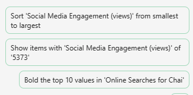

# Analyser une feuille de calcul sur les tendances du marché à l’aide de Copilot dans Excel
---
Les professionnels du marketing peuvent utiliser Copilot dans Excel pour analyser leurs données et obtenir des insights sur leur activité. Copilot dans Excel est un outil puissant qui peut aider les professionnels du marketing à créer, modifier, comprendre et visualiser facilement leurs données.

Par exemple, ils peuvent utiliser Copilot dans Excel pour analyser les résultats métier trimestriels, synthétiser les tendances clés, appliquer un code couleur aux tables, créer des modèles, des scénarios, filtrer et trier, et ajouter des graphiques d’un simple clic de souris. Les fonctionnalités basées sur l’IA de Copilot peuvent aider les professionnels du marketing à gagner du temps et de l’énergie en automatisant les tâches répétitives et en fournissant des insights précieux qui peuvent les aider à prendre des décisions éclairées. En utilisant Copilot dans Excel, ils peuvent se concentrer sur ce qui compte le plus : leurs objectifs métier.

Copilot dans Excel est un outil inestimable dans la boîte à outils du professionnel du marketing. Il offre une multitude d’avantages, notamment :

 -  **Mettre en évidence, filtrer et trier les données sans effort** : Copilot dans Excel peut aider les professionnels du marketing à rapidement identifier et organiser les données en les mettant en évidence, en les filtrant et en les triant. Par exemple, un professionnel du marketing peut utiliser Copilot pour filtrer les données non pertinentes dans un grand jeu de données, comme les données démographiques des clients, et se concentrer sur les données qui ont le plus de sens dans le cadre de leurs objectifs marketing.
 -  **Générer des suggestions de colonne de formule pour les calculs complexes** : Copilot dans Excel peut aider les professionnels du marketing à générer des suggestions de colonne de formule pour les calculs complexes, comme le calcul du retour sur investissement (ROI) de leurs campagnes marketing. Par exemple, un professionnel du marketing peut utiliser Copilot pour calculer le ROI de sa campagne marketing par e-mail en divisant les revenus générés par la campagne par le coût de la campagne.
 -  **Aider à analyser, comprendre et visualiser les données** : Copilot dans Excel peut aider les professionnels du marketing à analyser, comprendre et visualiser leurs données grâce à la puissance de l’IA. Par exemple, un professionnel du marketing peut utiliser Copilot pour identifier les tendances de ses données de vente et utiliser ces insights pour prendre des décisions éclairées sur ses stratégies marketing.

Quand vous utilisez Copilot dans Excel, vous devez avoir un tableau Excel avec des données dans une feuille de calcul. Vous pouvez transformer rapidement une plage de cellules en tableau Excel en suivant ces étapes :

1.  Sélectionnez la cellule ou la plage de données.
2.  Sélectionnez **Accueil** &gt; ** Mettre sous forme de tableau**.
3.  Dans la boîte de dialogue **Mettre sous forme de tableau**, cochez la case à côté de **Mon tableau a des en-têtes** si vous voulez que la première ligne de la plage soit la ligne d’en-tête.
4.  Cliquez sur **OK**.

Dans cet exercice, vous utilisez Copilot dans Excel pour analyser une feuille de calcul de tendance du marché qui déjà un tableau Excel défini. Cet exercice examine un grand nombre de fonctions et de prompts prédéfinis de Copilot. 

### Exercice

En tant que directeur du marketing chez Contoso Beverage, une division de Contoso, Ltd., vous avez reçu une feuille de calcul de tendance du marché montrant l’activité mensuelle du produit Chai Tea de Contoso en 2023. Vous voulez utiliser les fonctionnalités de Copilot dans Excel pour analyser le rapport et fournir une analyse détaillée des tendances marketing mensuelles en 2023. Dans cet exercice, vous passez en revue les prompts et fonctionnalités prédéfinis fournis par Copilot dans Excel.

Effectuez les étapes suivantes pour analyser la feuille de calcul de tendance du marché avec Copilot dans Excel :

1.  Si vous avez téléchargé la feuille de calcul [Contoso Chai Tea market trends 2023](https://edxinteractivepage.blob.core.windows.net/ms-4004/Contoso%20Chai%20Tea%20market%20trends%202023.xlsx) dans l’exercice précédent, passez à l’étape suivante. Sinon, sélectionnez le lien pour télécharger le fichier, déplacez le fichier dans votre compte OneDrive, puis ouvrez et fermez-le pour qu’il s’affiche dans votre liste des derniers fichiers utilisés.
2.  Si vous avez un onglet Microsoft 365 ouvert dans votre navigateur Microsoft Edge, sélectionnez-le maintenant, ou ouvrez un nouvel onglet et entrez l’URL suivante : **https://www.office.com**
3.  Dans la page d’accueil de **Microsoft 365**, sélectionnez l’icône **Excel** dans le volet de navigation à gauche.
4.  Dans **Excel**, dans la page **Fichier**, sélectionnez **Contoso Chai Tea market trends 2023.xlsx** dans la liste des fichiers.
5.  Sélectionnez l’option **Copilot** à droite du ruban.
6.  Dans le volet **Copilot** qui s’affiche, vous pouvez choisir parmi les différents prompts prédéfinis de la liste disponible. Sélectionnez le bouton **Afficher les insights de données**.
    
  
    
7.  Notez le graphique croisé dynamique qu’il a généré. Quand nous avons testé cet exercice, Copilot a toujours créé un graphique en courbes de **Social Media Engagement (views) by Date**. Quel type de graphique Copilot a-t-il créé pour vous ? Sous le graphique que Copilot a créé pour vous, sélectionnez le bouton **+Ajouter à une nouvelle feuille**.
8.  Sélectionnez **Feuille 2**. Passez en revue la nouvelle feuille de données créée par Copilot. Copilot a inclus à la fois le graphe et la colonne de données de la feuille de calcul à l’origine de ce graphe. Maintenez votre curseur sur le graphique et notez la fenêtre qui s’affiche avec le type de graphique généré par Copilot.
9.  Notez que, dans le volet Copilot, la liste des prompts prédéfinis ne s’affiche plus. Cette situation se produit parce que Copilot ne fonctionne pas encore sur les tableaux croisés dynamiques (notez le message indiquant ce problème). Sélectionnez **Feuille 1**, qui vous renvoie au tableau Excel. Notez que les prompts prédéfinis s’affichent.
10. Dans les prompts prédéfinis qui s’affichent au-dessus du champ de prompt, sélectionnez le bouton **Montrer des suggestions pour les colonnes de formule**.
11. Notez la suggestion fournie par Copilot. L’image suivante montre la suggestion que Copilot a fournie pendant notre test.
    
   
    
12. Dans la suggestion que vous avez reçue, sélectionnez la flèche déroulante **Expliquer la formule**. Passez en revue l’explication de Copilot qui décrit le calcul. Sélectionnez le bouton **+Insérer une colonne** pour insérer cette colonne dans votre tableau Excel.
13. Notez que Copilot a ajouté cette colonne de données à la fin de votre tableau Excel dans **Feuille 1**. Cette fonctionnalité vous a intrigué, donc vous voulez maintenant voir les autres suggestions de formule qu’il fournit. Sélectionnez à nouveau le bouton **Montrer des suggestions pour les colonnes de formule**. Notez la suggestion. Sélectionnez le bouton **+Insérer une colonne** pour insérer cette colonne suggérée dans votre tableau Excel.
14. Dans les prompts prédéfinis qui s’affichent au-dessus du champ de prompt, sélectionnez le bouton **Comment mettre en évidence, filtrer et trier les données** ?.
15. Notez la liste des actions que vous pouvez effectuer.
16. Passez en revue la liste révisée des prompts prédéfinis qui s’affichent maintenant. L’image suivante montre des exemples de prompts que nous avons reçus dans notre test.
    
   
    
17. L’objectif de cet exercice est d’obtenir une idée des différents types d’actions prédéfinies que Copilot peut effectuer. Vous pouvez donc sélectionner différents prompts pour voir ce qui se passe. Par exemple :
     -  Si un prompt **Trier** s’affiche, sélectionnez-le maintenant. Notez que Copilot a trié les données pour vous.
     -  Si un prompt **Gras** s’affiche, sélectionnez-le maintenant. Notez que Copilot a mis en gras les éléments de la colonne mentionnée et laissé les autres en police normale.
     -  Si un prompt **Mettre en évidence** s’affiche, sélectionnez-le maintenant. Notez la réponse de Copilot et la façon dont il a mis en évidence les données dans le tableau.
18. À ce stade, les prompts prédéfinis que Copilot affiche ne vous intéressent plus. Vous voulez donc voir un nouvel ensemble de prompts. Sélectionnez le bouton **Actualiser** qui s’affiche au-dessus du champ de prompt.
    
   
    
    
19. Passez en revue le nouvel ensemble de prompts affiché. Sélectionnez le bouton **Actualiser** plusieurs fois pour voir les différents prompts que Copilot fournit.
20. N’hésitez pas à sélectionner d’autres prompts pour voir ce que fait Copilot. Quand vous avez terminé, fermez l’onglet de navigateur Microsoft Edge.
