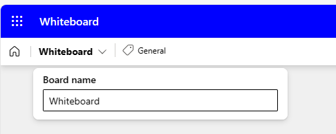

# Réfléchissez à des idées de plan de projet à l’aide de Microsoft 365 Copilot dans Whiteboard
---
Microsoft Whiteboard est un canevas numérique qui permet aux utilisateurs de collaborer en temps réel, de faire des sessions de brainstorming et de créer du contenu facilement. C’est un outil polyvalent que les professionnels de l’entreprise peuvent utiliser à diverses fins, telles que la gestion de projet, la réflexion conceptuelle et l’éducation. Les fonctionnalités de Whiteboard incluent le dessin de forme libre, les pense-bêtes et les modèles que vous pouvez personnaliser en fonction de vos besoins.

Le Operations Managers peuvent tirer parti de Microsoft Whiteboard de plusieurs façons. Whiteboard peut renforcer la collaboration en permettant à plusieurs utilisateurs de travailler simultanément dans un espace numérique, ce qui facilite le partage de visuels et d’idées. Il fournit également un espace que vous pouvez utiliser pour les projets, les sessions de brainstorming, les ateliers, les rétrospectives, la conception, la planification stratégique et pour résoudre les problèmes susceptibles d’avoir des éléments mobiles ou qui ont besoin de visuels supplémentaires. Whiteboard peut contribuer à accroître la productivité en fournissant un espace pour griffonner, partager des croquis de prototypes ou compiler une liste d’idées de nom de produit.

Dans cet exercice, vous êtes dans le rôle d’un Operations Manager qui souhaite installer une nouvelle chaudière dans le système de chauffage de votre bâtiment. Votre objectif à long terme est de créer un plan de projet pour le processus d’installation. Vous souhaitez utiliser Microsoft 365 Copilot pour Whiteboard pour suggérer les étapes nécessaires à la réalisation d’une telle installation. Considérez cet exercice comme étant essentiellement un exercice à pense-bête assisté par l’IA.

Avez-vous déjà participé à une session de brainstorming où des pense-bêtes étaient utilisés ? Les participants à la réunion écrivent des idées sur des pense-bêtes, puis les collent sur un tableau blanc ou un mur. À partir de là, l’animateur de réunion trie les notes en les organisant dans différentes catégories, supprime les idées en double, modifie des idées pour les clarifier, etc. Lorsque vous terminez la session, vous finissez par des piles d’idées, organisées en catégories.

En l’occurrence, c’est exactement le principe de cet exercice : un exercice avec des pense-bêtes virtuels, réalisé à l’aide de Microsoft 365 Copilot pour Whiteboard. Toutefois, dans ce cas, plutôt que d’écrire sur des pense-bêtes les idées générées par une salle pleine de personnes, c’est Copilot qui s’en charge. Regardez comme Copilot génère une liste d’idées, écrit chacune sur un pense-bête graphique et le colle votre canevas Whiteboard. En tant que animateur de réunion, vous pouvez ensuite modifier et supprimer n’importe laquelle des notes. Et puis, avec votre liste finale de notes en place, vous demanderez à Copilot d’organiser les pense-bêtes en différentes catégories. Ceci améliore la documentation future et permet de s’assurer qu’aucun des pense-bêtes n’est ignoré lors de la création du plan de projet.

### Exercice

En tant qu’Operations Manager chez Adatum Corporation, vous envisagez d’installer une nouvelle chaudière dans le système de chauffage de votre bâtiment. Toutefois, avant de commencer le processus d’installation, vous souhaitez utiliser Microsoft 365 Copilot pour Whiteboard pour suggérer les étapes potentielles que les entreprises effectuent généralement lorsqu’elles rénovent leur système de chauffage. Vous demandez ensuite à Copilot de catégoriser toutes les suggestions pour faciliter la recherche d’idées connexes et les regrouper. Dans ce cas, l’utilisation de Microsoft 365 Copilot pour Whiteboard permet de faciliter les discussions futures que vous envisagez d’avoir avec votre équipe à propos du processus d’installation.

1.  Dans votre navigateur Microsoft Edge, ouvrez un nouvel onglet et entrez l’URL suivante pour accéder à la page d’accueil de Microsoft 365 : **https://www.office.com**
2.  Dans la page d’accueil **Microsoft 365**, si une icône **Whiteboard** apparaît dans le volet de navigation de gauche, sélectionnez-la maintenant et passez à l’étape suivante. Sinon, sélectionnez l’icône **Apps** et, dans la page **Apps**, faites défiler vers le bas jusqu’à la section **Explorer par catégorie**, puis dans l’onglet **Productivité** (qui doit s’afficher par défaut), sélectionnez **Whiteboard**.
3.  Connectez-vous à **Microsoft Whiteboard**.
4.  Dans la page d’accueil de **Whiteboard**, sélectionnez **Nouveau tableau blanc**.
5.  Dans le ruban en haut de la page, sélectionnez la flèche déroulante **Whiteboard**. Dans le champ **Nom du tableau**, entrez **Plan de projet d’installation de chaudière**, puis sélectionnez l’icône de coche.

 
    
7.  Si une fenêtre **Suggérer du contenu avec Copilot** s’affiche, passez à l’étape suivante. Sinon, dans la barre d’état des icônes qui apparaît au-dessus de la barre des tâches en bas de la page, sélectionnez l’icône **Copilot**. Dans le menu qui s’affiche, sélectionnez **Suggérer**.
8.  Dans la fenêtre **Suggérer du contenu avec Copilot**, entrez le prompt suivant :
    
    **Je suis Operations Manager pour Adatum Corporation. Nous installons une nouvelle chaudière dans notre système de chauffage. Veuillez suggérer les étapes à suivre pour installer la nouvelle chaudière**.
9.  Si une fenêtre **Suggérer du contenu avec Copilot** s’affiche, passez à l’étape suivante. Toutefois, si vous recevez un message indiquant que «**Il y a eu un problème. Réessayez.**  » ou «**Copilot n’a pas pu traiter ce prompt. Veuillez le reformuler.**  » sélectionnez ensuite la flèche **Générer des suggestions** dans le coin inférieur de la fenêtre Copilot.
    
    
    
    
    Parfois, Copilot termine le processus sur lequel il travaille, mais hésite un peu avant d’afficher les résultats. Lorsque vous sélectionnez la flèche **Générer des suggestions** à nouveau, elle affiche généralement les résultats sans trop de retard. Toutefois, si vous recevez un message similaire une deuxième fois, sélectionnez la flèche **Générer une suggestion** plusieurs fois. Si vous continuez à recevoir cette erreur après trois ou quatre tentatives, simplifiez le prompt en entrant le texte suivant :
    
    **Veuillez suggérer les étapes à suivre pour installer une nouvelle chaudière dans le système de chauffage de notre bâtiment**.
10.  Par défaut, Copilot génère des idées en groupes de six. Dans la fenêtre **Suggérer du contenu avec Copilot** qui s’affiche, notez les six premières idées qui ont été générées. Copilot vous fournit deux options à ce stade : vous pouvez joindre les idées à votre tableau blanc si les suggestions vous conviennent ou vous pouvez demander à Copilot d’en générer. Notez comment le bouton **Insérer (6)** indique le nombre d’idées générées par Copilot, dans ce cas, 6. Bien que six suggestions soient un bon point de départ, il vous faut approfondir les tâches nécessaires pour installer le produit de sécurité. Sélectionnez donc le bouton **Générer plus**.

     > **REMARQUE :** Si Copilot affiche un message d’erreur de n’importe quel type, sélectionnez à nouveau le bouton **Générer plus**. Procédez de la sorte chaque fois que vous recevez un message d’erreur. 
      
12. Notez comment Copilot a généré six autres idées, de sorte que le bouton **Insérer (12)** affiche désormais **12**. Bien que vous puissiez continuer à générer plus d’idées, pour des raisons de temps, insérons les 12 idées actuellement présentées. Sélectionnez le bouton **Insérer (12)**.
13. Lorsque vous sélectionnez le bouton **Insérer**, Copilot attache les idées suggérées à votre tableau blanc sous la forme de pense-bête jaunes. Comme avec une session de brainstorming réelle impliquant des pense-bêtes réelles, vous pouvez modifier une note particulière, la supprimer, la verrouiller de la suppression future, et ainsi de suite. Dans Microsoft Whiteboard, ces activités sont prises en charge par le biais de fonctionnalités de tableau blanc standard.
    
    Si vous n’avez jamais utilisé Whiteboard auparavant, essayez de sélectionner (double-cliquez) une note spécifique, puis dans la barre de menus qui s’affiche au-dessus, vous pouvez sélectionner l’icône **Modifier le texte** (crayon) ou l’une des autres options. La sélection de l’icône des points de suspension à la fin de la barre de menus affiche un menu d’autres options, telles que la suppression de la note. Là encore, l’idée de Microsoft Whiteboard est d’imiter des exercices de pense-bêtes réels. N’hésitez pas à modifier une note comme vous le souhaitez.
14. En examinant les idées suggérées, vous pensez qu’elles ne couvrent pas adéquatement l’atténuation des risques. Sélectionnez l’icône **Copilot** en bas de la page, puis sélectionnez **Suggérer** dans le menu.
15. Dans la fenêtre **Suggérer du contenu avec Copilot** qui s’affiche, entrez le prompt suivant pour générer plus d’idées sur l’atténuation des risques :
    
    **Suggérer des moyens d’atténuer les risques d’installation d’une nouvelle chaudière dans le système de chauffage du bâtiment**.
16. Passez en revue les six idées suggérées par Copilot. Vous souhaitez que Copilot inclue plus de détails. Sélectionnez le bouton **Générer plus**.
17. Les 12 idées d’atténuation des risques vous conviennent, alors sélectionnez le bouton **Insérer (12)** . Notez comment le bloc de 12 idées d’atténuation des risques est sélectionné (voir la bordure extérieure). Si Copilot superpose les 12 idées d’atténuation des risques partiellement sur les 12 idées de plan de projet originales, vous pouvez sélectionner sur ce bloc d’idées et le déplacer sur l’écran, afin qu’il ne soit plus superposé aux 12 idées originales. Ne vous préoccupez pas d’aligner les deux blocs. Une fois que vous organisez les notes en catégories dans une étape ultérieure, elles auront une apparence agréable. Pour l’instant, organisez chaque bloc pour que vous puissiez voir toutes les idées. Cela fournit la visibilité nécessaire pour voir les zones proposées par Copilot afin que vous puissiez les modifier si vous le souhaitez.
18. Vous êtes maintenant satisfait des suggestions que Copilot a créées et vous avez terminé toutes les modifications que vous souhaitez apporter aux notes. Vous souhaitez maintenant que Copilot organise les notes par catégorie. Copilot détermine les noms des catégories et organise automatiquement les notes en fonction. Sélectionnez l’icône **Copilot** en bas de la page, puis sélectionnez **Catégoriser** dans le menu.
19. Notez ce qui s’est passé. Copilot a généré un ensemble de catégories et réorganisé les notes en fonction. Une couleur différente a été attribuée à chaque catégorie de notes, afin d’identifier les différences entre les catégories. Si le rectangle contenant les notes n’est pas aussi grand qu’il pourrait l’être et qu’il s’adapte toujours à votre écran, sélectionnez l’icône **Ajuster à l’écran** dans le coin inférieur droit de la page. Cela augmente la taille de l’image jusqu’à ce qu’elle arrive à la limite de l’écran.
20. Notez la barre d’état d’icône qui apparaît sous le groupe organisé de notes. Si vous n’êtes pas satisfait des catégories, sélectionnez le bouton **Régénérer** sur la barre d’état d’icône qui s’affiche.
    
    > **REMARQUE :** Vous pouvez sélectionner le bouton **Régénérer** autant de fois que nécessaire jusqu’à ce que vous soyez satisfait des catégories que Copilot fournit. Sélectionnez ce bouton plusieurs fois et notez les modifications apportées à Copilot à chaque fois. Outre la modification des noms de catégorie, Copilot peut ajouter ou réduire le nombre de catégories avec chaque régénération.

21. Après avoir régénéré les catégories plusieurs fois, vous réalisez qu’il vous manque des étapes détaillées concernant la minimisation des temps d’arrêt du système. Vous souhaitez demander à Copilot d’ajouter d’autres idées à votre session Whiteboard concernant ce problème. De plus, vous avez identifié une note que vous souhaitez supprimer. Toutefois, étant donné que vous avez déjà organisé vos idées, vous devez remettre votre session Whiteboard dans le mode édition où vous étiez avant de catégoriser les notes. Pour cela, sélectionnez le bouton **Rétablir**.
22. Maintenant que vous êtes de retour en mode édition, sélectionnez une note que vous ne souhaitez plus, puis dans la barre d’état d’icône qui s’affiche, sélectionnez l’icône des points de suspension. Dans le menu qui s’affiche, sélectionnez **Supprimer**.
23. Pour que Copilot génère plus d’idées, sélectionnez l’icône **Copilot** en bas de la page, puis sélectionnez **Suggérer** dans le menu.
24. Dans la fenêtre **Suggérer du contenu avec Copilot** qui s’affiche, entrez le prompt suivant pour générer plus d’idées sur la réduction du temps d’arrêt du système :
    
    **Suggérer des moyens de limiter le temps d’arrêt du système de chauffage lors de l’installation d’une nouvelle chaudière**.
25. Passez en revue les six idées suggérées par Copilot. Ces 6 idées vous conviennent, alors sélectionnez le bouton **Insérer (6)** .
26. Notez comment le bloc de six notes est mis en surbrillance avec une ligne autour du bloc. Ce bloc de notes est appelé grille de notes. Vous pouvez déplacer ou redimensionner une grille de notes comme n’importe quel autre élément de votre tableau blanc. Lorsque vous redimensionnez une grille de notes, les tailles de tous les pense-bêtes à l’intérieur de celle-ci s’ajustent en conséquence. Si le bloc de six notes est superposé à l’un des blocs de notes, sélectionnez l’une des lignes extérieures autour de la grille de notes et faites glisser le bloc entier de six notes sur le côté, afin qu’il ne soit superposé sur aucune des notes précédentes. Si vous n’avez plus d’espace sur l’écran et qu’une partie du bloc sort de l’écran, sélectionnez l’icône **Ajuster à l’écran** dans le coin inférieur droit de la page.
27. C’est le moment pour Copilot d’organiser les pense-bêtes, qui incluent 18 notes - un bloc de 12 notes et un bloc de six notes. Sélectionnez l’icône **Copilot** en bas de la page, puis sélectionnez **Catégoriser** dans le menu. Dans la fenêtre **Catégoriser les notes sélectionnées ?**, sélectionnez le bouton **Catégoriser**.
28. Parfois, le rectangle contenant les notes n’est pas aussi grand que possible, ce qui laisse un espace blanc ouvert tout autour de votre canevas. Dans ce cas, la taille du texte des notes est souvent petite et difficile à lire. Si ce problème de dimensionnement se produit, sélectionnez l’icône **Ajuster à l’écran** en bas à droite de la page. Cela augmente la taille de l’image. Si vous continuez à sélectionner ce bouton, vous atteindrez un stade où il n’est plus possible d’augmenter la taille du rectangle sans dépasser la taille de l’écran. Toute sélection supplémentaire de cette icône n’a aucun effet sur le rectangle.
29. Passez en revue les catégories. Dans la barre d’état d’icône Copilot qui apparaît sous le rectangle, vous pouvez sélectionner le bouton **Régénérer** pour créer un ensemble de catégories. En fait, sélectionnez le bouton **Régénérer** plusieurs fois pour voir comment les catégories changent. Une fois que les résultats vous conviennent, sélectionnez le bouton **Conserver**.
30. Notez comment chaque catégorie de pense-bêtes a une couleur différente. Vous vous rendez compte que vous souhaitez obtenir un bref résumé de la session de brainstorming ajoutée au contenu de votre tableau blanc. Sélectionnez l’icône **Copilot** en bas de la page, puis sélectionnez **Résumer** dans le menu. Copilot génère un bref résumé des principaux thèmes de cette session de tableau blanc. Faites défiler vers le bas pour passer en revue l’intégralité de la fenêtre **Résumé**. Vous êtes satisfait des résultats, alors sélectionnez **Conserver**.
31. Sélectionnez l’icône **Ajuster à l’écran** en bas à droite de la page pour ajuster tous les pense-bêtes et le résumé de la session sur l’écran entier.
